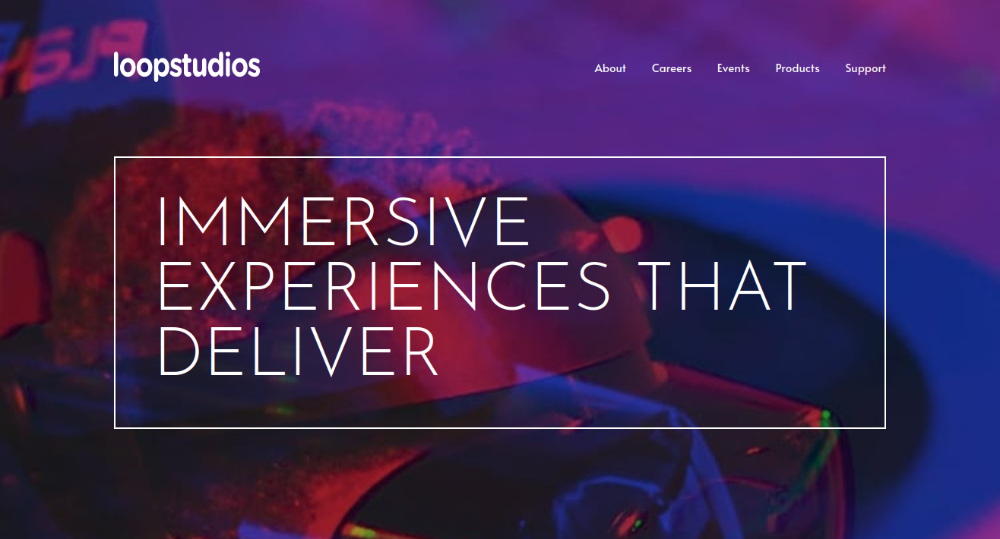

# Frontend Mentor - Loopstudios landing page solution

This is a solution to the [Loopstudios landing page challenge on Frontend Mentor](https://www.frontendmentor.io/challenges/loopstudios-landing-page-N88J5Onjw). Frontend Mentor challenges help you improve your coding skills by building realistic projects.

## Table of contents

- [Overview](#overview)
  - [The challenge](#the-challenge)
  - [Screenshot](#screenshot)
  - [Links](#links)
- [My process](#my-process)
  - [Built with](#built-with)
  - [What I learned](#what-i-learned)
- [Author](#author)

## Overview

### The challenge

Users should be able to:

- View the optimal layout for the site depending on their device's screen size
- See hover states for all interactive elements on the page

### Screenshot

### Links

- Solution URL: [https://www.frontendmentor.io/solutions/scss-typescript-snowpack--bhbzMqa1](https://www.frontendmentor.io/solutions/scss-typescript-snowpack--bhbzMqa1)
- Live Site URL: [https://loopstudios-landing-page-nicm42.vercel.app/](https://loopstudios-landing-page-nicm42.vercel.app/)

## My process

### Built with

- HTML
- SCSS
- TypeScript
- Snowpack

### What I learned

Snowpack

## Author

- Website - [Nic](https://www.nicm42.co.uk)
- Frontend Mentor - [@nicm42](https://www.frontendmentor.io/profile/nicm42)
- Twitter - [@nicm4242](https://www.twitter.com/nicm4242)
